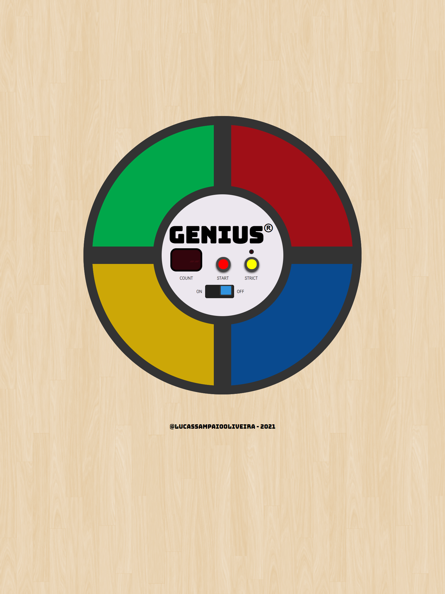

# Genius

## O que eu aprendi com esse projeto:

- CSS
  - Variáveis CSS
  - Unidade rem
  - BEM
  - Flexbox
  - Pseudo-elementos
  - Media Queries
  
- Javascript
  - .addEventListener()
  - .querySelector()
  - .classList
  - .forEach()
  - .push()
  - for Loop
  - if else statements
  - carregar sons
  - setTimeout()
  - setInterval()

